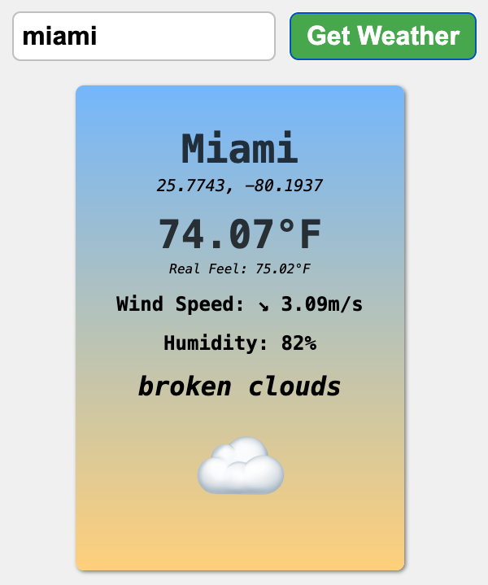

# Weather App

A dynamic weather application built with **HTML**, **CSS**, and **JavaScript** that fetches real-time weather data using the **OpenWeatherMap API**. Enter any city to view current weather conditions with temperature, humidity, wind speed, and weather-specific emojis.

## Features
- 🌍 Search weather by city name
- 🌡️ Real-time temperature (Fahrenheit) with "feels like" value
- 💧 Humidity percentage display
- 💨 Wind speed and direction with arrow indicators
- 🌤️ Weather condition description and emoji
- 📍 Geographic coordinates (latitude/longitude)
- 🎨 Gradient card design (blue to yellow)
- ⚠️ Error handling for invalid cities or API failures
- 🔄 Async/await for smooth data fetching

## Requirements
- Any modern web browser (Chrome, Firefox, Safari, Edge)
- Active internet connection
- OpenWeatherMap API key (included in code)

## Project structure
```
.
├── weather.html
├── weather.css
└── weather.js
```

## Screenshots


* The weather card displays:
  - **City name** (3rem, bold, dark text) - e.g., "Miami"
  - **Coordinates** (1.25rem, italic) - latitude and longitude
  - **Temperature** (3rem, bold) - in Fahrenheit (°F)
  - **Real Feel** (1rem, italic) - perceived temperature
  - **Wind Speed** (bold) - direction arrow + speed in m/s
  - **Humidity** (bold) - percentage
  - **Description** (2rem, italic, bold) - weather condition text
  - **Weather Emoji** (7rem) - visual representation of conditions
  - **Gradient background** - blue to yellow (`hsl(210, 100%, 75%)` to `hsl(40, 100%, 75%)`)
  - **Box shadow** for depth effect

## Usage
1. Open `weather.html` in your web browser
2. Enter a city name in the input field (e.g., "London", "Tokyo", "Paris")
3. Click **Get Weather** button or press Enter
4. View the weather information displayed on the card
5. Search for another city to update the display

## API Integration

### OpenWeatherMap API
The app uses the OpenWeatherMap Current Weather Data API:
```javascript
const apiUrl = `https://api.openweathermap.org/data/2.5/weather?q=${city}&appid=${apiKey}`;
```

**Note**: The API key included (`0b27dee62b5909ebbbf9788a2e85e2b2`) is for demonstration purposes. For production use, register for your own free API key at [OpenWeatherMap](https://openweathermap.org/api).

## Functionality

### Main Functions

**1. Event Listener (Form Submit)**
```javascript
weatherForm.addEventListener("submit", async event => {
    event.preventDefault(); // Prevents page refresh
    const city = cityInput.value;
    // Fetches and displays weather data or shows error
});
```

**2. getWeatherData(city)**
- Constructs API URL with city name and API key
- Fetches data from OpenWeatherMap
- Returns JSON response
- Throws error if fetch fails
```javascript
async function getWeatherData(city) {
    const response = await fetch(apiUrl);
    if(!response.ok) {
        throw new Error("Could Not Fetch Weather Data");
    }
    return await response.json();
}
```

**3. displayWeatherInfo(data)**
- Extracts relevant data using destructuring:
  - City name
  - Temperature and feels-like temperature
  - Humidity
  - Weather description and ID
  - Coordinates (lat/lon)
  - Wind degree and speed
- Converts temperature from Kelvin to Fahrenheit: `(temp - 273.15) * (9/5) + 32`
- Creates and styles HTML elements dynamically
- Appends all elements to the card

**4. getWeatherEmoji(weatherId)**
Returns appropriate emoji based on OpenWeatherMap weather ID:
- **200-299**: ⛈️ Thunderstorm
- **300-399**: ☔ Drizzle
- **500-599**: 🌧️ Rain
- **600-699**: ❄️ Snow
- **700-799**: 🌫️ Fog
- **800**: ☀️ Clear/Sunny
- **801-809**: ☁️ Cloudy
- **Default**: ❓ Unknown

**5. getWindDirection(deg)**
Converts wind degree (0-360) to directional arrow:
- **337.5-22.5°**: ↑ North
- **22.5-67.5°**: ↗ Northeast
- **67.5-112.5°**: → East
- **112.5-157.5°**: ↘ Southeast
- **157.5-202.5°**: ↓ South
- **202.5-247.5°**: ↙ Southwest
- **247.5-292.5°**: ← West
- **292.5-337.5°**: ↖ Northwest

**6. displayError(message)**
- Displays user-friendly error messages
- Shows errors for:
  - Empty city input
  - Invalid city names
  - API fetch failures

## Temperature Conversion
Kelvin to Fahrenheit formula used:
```javascript
const fahrenheit = ((kelvin - 273.15) * (9/5) + 32).toFixed(2);
```

## Customize
- **API Key**: Replace `apiKey` value with your own
- **Temperature Unit**: Modify conversion formula for Celsius:
```javascript
  tempDisplay.textContent = `${(temp - 273.15).toFixed(2)}°C`;
```
- **Gradient colors**: Change `linear-gradient()` values in `.card`
  - Top: `hsl(210, 100%, 75%)` (light blue)
  - Bottom: `hsl(40, 100%, 75%)` (light yellow)
- **Button color**: Modify `background-color: hsl(122, 39%, 50%);` in `button[type="submit"]`
- **Card size**: Adjust `min-width: 300px` and `padding: 50px`
- **Font sizes**: Customize various element sizes in CSS

## Error Handling
The app includes comprehensive error handling:
- **Empty input**: "Please Enter A City"
- **Invalid city**: "Could Not Fetch Weather Data"
- **Network errors**: Caught and logged to console
- **API response validation**: Checks `response.ok` status

All errors are displayed in the card with appropriate styling.

## Data Displayed
- **City Name**: From API response
- **Coordinates**: Latitude and longitude
- **Temperature**: Converted to Fahrenheit with 2 decimal places
- **Real Feel**: "Feels like" temperature
- **Wind**: Direction arrow + speed in meters/second
- **Humidity**: Percentage
- **Description**: Weather condition text (e.g., "clear sky", "light rain")
- **Emoji**: Visual weather indicator

## Notes
- Card is hidden by default (`display: none`) and appears only after search
- Previous search results are cleared before displaying new data
- Uses `event.preventDefault()` to prevent form submission page reload
- Temperature data from API is in Kelvin by default
- Wind degree ranges from 0-360 (meteorological convention)
- All API calls use async/await for better error handling
- Console logs API responses for debugging purposes

## API Response Structure
The app destructures the following from the OpenWeatherMap JSON response:
```javascript
{
    name: city,
    main: {temp, humidity, feels_like},
    weather: [{description, id}],
    coord: {lat, lon},
    wind: {deg, speed}
}
```

## Possible Enhancements
- Add 5-day forecast display
- Implement geolocation for automatic city detection
- Add temperature unit toggle (°F/°C)
- Store recent searches in localStorage
- Add weather alerts and warnings
- Implement autocomplete for city search
- Add loading spinner during API calls
- Display sunrise/sunset times

---

Stay weather-ready! ☀️🌧️❄️